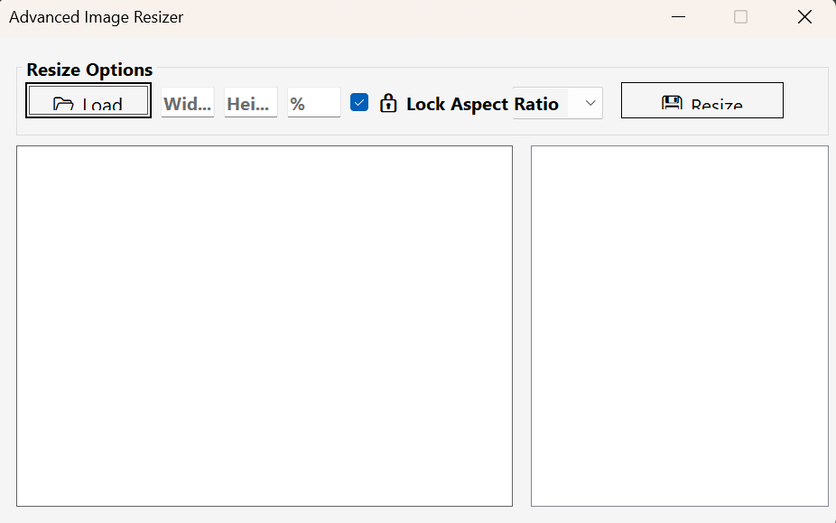

# 🖼️ Advanced Image Resizer (WinForms)

A simple but powerful Windows Forms application built with C# (.NET) that allows users to **load**, **resize**, and **save** images in multiple formats (PNG, JPEG, BMP). It also keeps a history of saved images and supports drag-and-drop image loading.

---

## 🚀 Features

- 📂 Load images from file or drag-and-drop
- 📏 Resize by width/height or percentage
- 🔒 Lock aspect ratio option
- 💾 Save as PNG, JPEG, or BMP
- 🧠 Intelligent resizing with high-quality interpolation
- 🕘 Resize history tracking

---

## 🖥️ UI Overview

| UI Element        | Description                              |
|-------------------|------------------------------------------|
| 📂 Load Image     | Opens file dialog to load image          |
| Width / Height    | Manual input for target size             |
| % (Percent)       | Resize image by scale percentage         |
| 🔒 Aspect Lock     | Maintains original image proportions     |
| Format Dropdown   | Select PNG / JPEG / BMP for saving       |
| 💾 Resize & Save  | Resizes image and saves to selected path |
| History List      | Displays all saved images in session     |

---

## 📦 Project Structure

AdvancedImageResizerWinForms/
│
├── Program.cs # Entry point of the application
├── MainForm.cs # Main UI and logic implementation
├── AdvancedImageResizerWinForms.csproj
└── README.md # You're reading it!

## 🛠️ Requirements

- ✅ .NET 6.0 or later
- ✅ Windows OS (WinForms is Windows-only)
- ✅ Visual Studio 2022+ or JetBrains Rider

---

## ⚙️ How to Run

1. **Clone the repo** or download the source.
2. **Open the project in Visual Studio.**
3. Set `AdvancedImageResizerWinForms` as the **Startup Project**.
4. Click **Run (▶️)** or press `F5`.

---

## 📸 Screenshots

---

## ✅ Future Enhancements

- [ ] Image preview before saving
- [ ] Resize multiple images (batch)
- [ ] Custom output directory
- [ ] Dark mode theme toggle

---

## 🧑‍💻 Author

**Nishant Chaubey**  
📧 [chaubeynishant2@gmail.com or (https://github.com/NishantChaubey534)]

---

## 📄 License

This project is licensed under the MIT License. See [LICENSE](LICENSE) for details.
